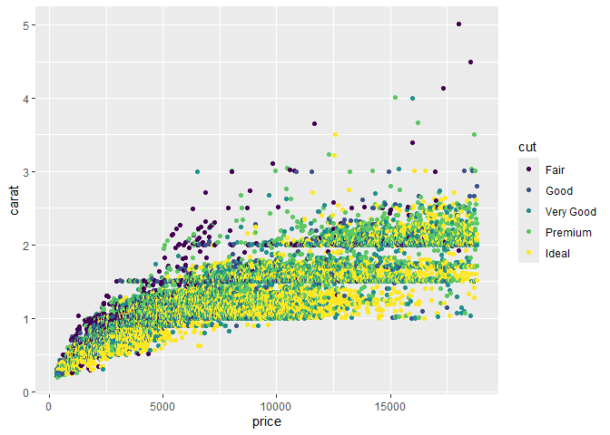
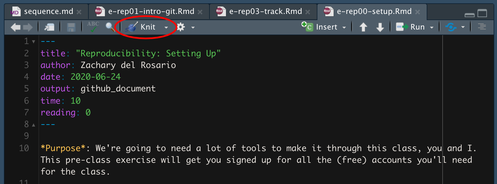

Getting Started: Diamonds
================
Amir Osorio
1/27/25

- [Grading Rubric](#grading-rubric)
  - [Individual](#individual)
  - [Submission](#submission)
- [Data Exploration](#data-exploration)
  - [**q1** Create a plot of `price` vs `carat` of the `diamonds`
    dataset below. Document your observations from the
    visual.](#q1-create-a-plot-of-price-vs-carat-of-the-diamonds-dataset-below-document-your-observations-from-the-visual)
  - [**q2** Create a visualization showing variables `carat`, `price`,
    and `cut` simultaneously. Experiment with which variable you assign
    to which aesthetic (`x`, `y`, etc.) to find an effective
    visual.](#q2-create-a-visualization-showing-variables-carat-price-and-cut-simultaneously-experiment-with-which-variable-you-assign-to-which-aesthetic-x-y-etc-to-find-an-effective-visual)
- [Communication](#communication)
  - [**q3** *Knit* your document in order to create a
    report.](#q3-knit-your-document-in-order-to-create-a-report)
  - [**q4** *Push* your knitted document to
    GitHub.](#q4-push-your-knitted-document-to-github)
  - [**q5** *Submit* your work to
    Canvas](#q5-submit-your-work-to-canvas)
  - [**q6** *Prepare* to present your team’s
    findings!](#q6-prepare-to-present-your-teams-findings)

*Purpose*: Throughout this course, you’ll complete a large number of
*exercises* and *challenges*. Exercises are meant to introduce content
with easy-to-solve problems, while challenges are meant to make you
think more deeply about and apply the content. The challenges will start
out highly-scaffolded, and become progressively open-ended.

In this challenge, you will go through the process of exploring,
documenting, and sharing an analysis of a dataset. We will use these
skills again and again in each challenge.

*Note*: You will have seen all of these steps in `e-vis00-basics`. This
challenge is *primarily* a practice run of the submission system. The
Data Exploration part should be very simple.

<!-- include-rubric -->

# Grading Rubric

<!-- -------------------------------------------------- -->

Unlike exercises, **challenges will be graded**. The following rubrics
define how you will be graded, both on an individual and team basis.

## Individual

<!-- --------------------------->

| Category | Needs Improvement | Satisfactory |
|----|----|----|
| Effort | Some task **q**’s left unattempted | All task **q**’s attempted |
| Observed | Did not document observations, or observations incorrect | Documented correct observations based on analysis |
| Supported | Some observations not clearly supported by analysis | All observations clearly supported by analysis (table, graph, etc.) |
| Assessed | Observations include claims not supported by the data, or reflect a level of certainty not warranted by the data | Observations are appropriately qualified by the quality & relevance of the data and (in)conclusiveness of the support |
| Specified | Uses the phrase “more data are necessary” without clarification | Any statement that “more data are necessary” specifies which *specific* data are needed to answer what *specific* question |
| Code Styled | Violations of the [style guide](https://style.tidyverse.org/) hinder readability | Code sufficiently close to the [style guide](https://style.tidyverse.org/) |

## Submission

<!----------------------------->

Make sure to commit both the challenge report (`report.md` file) and
supporting files (`report_files/` folder) when you are done! Then submit
a link to Canvas. **Your Challenge submission is not complete without
all files uploaded to GitHub.**

``` r
library(tidyverse)
```

    ## ── Attaching core tidyverse packages ──────────────────────── tidyverse 2.0.0 ──
    ## ✔ dplyr     1.1.4     ✔ readr     2.1.5
    ## ✔ forcats   1.0.0     ✔ stringr   1.5.1
    ## ✔ ggplot2   3.5.1     ✔ tibble    3.2.1
    ## ✔ lubridate 1.9.4     ✔ tidyr     1.3.1
    ## ✔ purrr     1.0.2     
    ## ── Conflicts ────────────────────────────────────────── tidyverse_conflicts() ──
    ## ✖ dplyr::filter() masks stats::filter()
    ## ✖ dplyr::lag()    masks stats::lag()
    ## ℹ Use the conflicted package (<http://conflicted.r-lib.org/>) to force all conflicts to become errors

# Data Exploration

<!-- -------------------------------------------------- -->

In this first stage, you will explore the `diamonds` dataset and
document your observations.

### **q1** Create a plot of `price` vs `carat` of the `diamonds` dataset below. Document your observations from the visual.

*Hint*: We learned how to do this in `e-vis00-basics`!

``` r
ggplot(diamonds, aes(x = carat, y = price)) + 
  geom_point()
```

<!-- -->

**Observations**:

- I can see the plot, I do think that this is a good representation of
  the information. Looking at the graph, I can see that there is almost
  this linear relationship from 0 to 1 carats. Then from 1 to 3 carats,
  we see this exponential growth, but at the same time we can also see a
  pretty strange phenomenon where they are many points in the data that
  group up at the 1, 1.5 and 2 carat mark. From this, I would suggest
  that there is something else that is affecting the price of the
  diamonds other than simply just the carats.

### **q2** Create a visualization showing variables `carat`, `price`, and `cut` simultaneously. Experiment with which variable you assign to which aesthetic (`x`, `y`, etc.) to find an effective visual.

``` r
ggplot(diamonds, aes(x = carat, y = price, color = cut)) + 
  geom_point()
```

<!-- -->

**Observations**:

- I really do think that the small addition of the cut as the color
  really helps in visualizing the data.It helps understand the relation
  between the 3 characteristics of the diamond.

As mentioned in my previous observation, we can still see the linear
relationship from 0 to 1 carats, then from 1 to 3 carats,this
exponential growth and finally the phenomenon that happens on the 1, 1.5
and 2 carat marks. However, we can now see with the representation on
“Cut” with color, that cut doesnt affect the price of a diamond that
much, as you can have a fair cut and have the price be very high ( as
shown in the top right corner of the graph), but also have an Ideal cut
and have the price be fairly low (as shown at the bottom right).

# Communication

<!-- -------------------------------------------------- -->

In this next stage, you will render your data exploration, push it to
GitHub to share with others, and link your observations within our [Data
Science
Wiki](https://olin-data-science.fandom.com/wiki/Olin_Data_Science_Wiki).

### **q3** *Knit* your document in order to create a report.

You can do this by clicking the “Knit” button at the top of your
document in RStudio.

<figure>

<figcaption aria-hidden="true">Terminal</figcaption>
</figure>

This will create a local `.md` file, and RStudio will automatically open
a preview window so you can view your knitted document.

### **q4** *Push* your knitted document to GitHub.

<figure>

<figcaption aria-hidden="true">Terminal</figcaption>
</figure>

You will need to stage both the `.md` file, as well as the `_files`
folder. Note that the `_files` folder, when staged, will expand to
include all the files under that directory.

<figure>

<figcaption aria-hidden="true">Terminal</figcaption>
</figure>

### **q5** *Submit* your work to Canvas

Navigate to your GitHub repository’s website and find the URL that
corresponds to your report. Submit this to Canvas to complete the
assignment.

### **q6** *Prepare* to present your team’s findings!

If your team is on-deck, you are responsible for putting together a
discussion of the challenge. I’ll demonstrate how to do this by leading
the discussion of Challenge 0.
