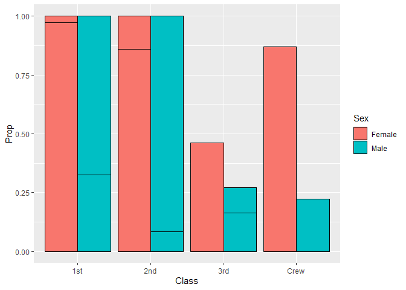

RMS Titanic
================
Amir Osorio
2020-2-5

- [Grading Rubric](#grading-rubric)
  - [Individual](#individual)
  - [Submission](#submission)
- [First Look](#first-look)
  - [**q1** Perform a glimpse of `df_titanic`. What variables are in
    this
    dataset?](#q1-perform-a-glimpse-of-df_titanic-what-variables-are-in-this-dataset)
  - [**q2** Skim the Wikipedia article on the RMS Titanic, and look for
    a total count of souls aboard. Compare against the total computed
    below. Are there any differences? Are those differences large or
    small? What might account for those
    differences?](#q2-skim-the-wikipedia-article-on-the-rms-titanic-and-look-for-a-total-count-of-souls-aboard-compare-against-the-total-computed-below-are-there-any-differences-are-those-differences-large-or-small-what-might-account-for-those-differences)
  - [**q3** Create a plot showing the count of persons who *did*
    survive, along with aesthetics for `Class` and `Sex`. Document your
    observations
    below.](#q3-create-a-plot-showing-the-count-of-persons-who-did-survive-along-with-aesthetics-for-class-and-sex-document-your-observations-below)
- [Deeper Look](#deeper-look)
  - [**q4** Replicate your visual from q3, but display `Prop` in place
    of `n`. Document your observations, and note any new/different
    observations you make in comparison with q3. Is there anything
    *fishy* in your
    plot?](#q4-replicate-your-visual-from-q3-but-display-prop-in-place-of-n-document-your-observations-and-note-any-newdifferent-observations-you-make-in-comparison-with-q3-is-there-anything-fishy-in-your-plot)
  - [**q5** Create a plot showing the group-proportion of occupants who
    *did* survive, along with aesthetics for `Class`, `Sex`, *and*
    `Age`. Document your observations
    below.](#q5-create-a-plot-showing-the-group-proportion-of-occupants-who-did-survive-along-with-aesthetics-for-class-sex-and-age-document-your-observations-below)
- [Notes](#notes)

*Purpose*: Most datasets have at least a few variables. Part of our task
in analyzing a dataset is to understand trends as they vary across these
different variables. Unless we’re careful and thorough, we can easily
miss these patterns. In this challenge you’ll analyze a dataset with a
small number of categorical variables and try to find differences among
the groups.

*Reading*: (Optional) [Wikipedia
article](https://en.wikipedia.org/wiki/RMS_Titanic) on the RMS Titanic.

<!-- include-rubric -->

# Grading Rubric

<!-- -------------------------------------------------- -->

Unlike exercises, **challenges will be graded**. The following rubrics
define how you will be graded, both on an individual and team basis.

## Individual

<!-- ------------------------- -->

| Category | Needs Improvement | Satisfactory |
|----|----|----|
| Effort | Some task **q**’s left unattempted | All task **q**’s attempted |
| Observed | Did not document observations, or observations incorrect | Documented correct observations based on analysis |
| Supported | Some observations not clearly supported by analysis | All observations clearly supported by analysis (table, graph, etc.) |
| Assessed | Observations include claims not supported by the data, or reflect a level of certainty not warranted by the data | Observations are appropriately qualified by the quality & relevance of the data and (in)conclusiveness of the support |
| Specified | Uses the phrase “more data are necessary” without clarification | Any statement that “more data are necessary” specifies which *specific* data are needed to answer what *specific* question |
| Code Styled | Violations of the [style guide](https://style.tidyverse.org/) hinder readability | Code sufficiently close to the [style guide](https://style.tidyverse.org/) |

## Submission

<!-- ------------------------- -->

Make sure to commit both the challenge report (`report.md` file) and
supporting files (`report_files/` folder) when you are done! Then submit
a link to Canvas. **Your Challenge submission is not complete without
all files uploaded to GitHub.**

``` r
library(tidyverse)
```

    ## ── Attaching core tidyverse packages ──────────────────────── tidyverse 2.0.0 ──
    ## ✔ dplyr     1.1.4     ✔ readr     2.1.5
    ## ✔ forcats   1.0.0     ✔ stringr   1.5.1
    ## ✔ ggplot2   3.5.1     ✔ tibble    3.2.1
    ## ✔ lubridate 1.9.4     ✔ tidyr     1.3.1
    ## ✔ purrr     1.0.2     
    ## ── Conflicts ────────────────────────────────────────── tidyverse_conflicts() ──
    ## ✖ dplyr::filter() masks stats::filter()
    ## ✖ dplyr::lag()    masks stats::lag()
    ## ℹ Use the conflicted package (<http://conflicted.r-lib.org/>) to force all conflicts to become errors

``` r
df_titanic <- as_tibble(Titanic)
```

*Background*: The RMS Titanic sank on its maiden voyage in 1912; about
67% of its passengers died.

# First Look

<!-- -------------------------------------------------- -->

### **q1** Perform a glimpse of `df_titanic`. What variables are in this dataset?

``` r
## TASK: Perform a `glimpse` of df_titanic
glimpse(df_titanic)
```

    ## Rows: 32
    ## Columns: 5
    ## $ Class    <chr> "1st", "2nd", "3rd", "Crew", "1st", "2nd", "3rd", "Crew", "1s…
    ## $ Sex      <chr> "Male", "Male", "Male", "Male", "Female", "Female", "Female",…
    ## $ Age      <chr> "Child", "Child", "Child", "Child", "Child", "Child", "Child"…
    ## $ Survived <chr> "No", "No", "No", "No", "No", "No", "No", "No", "No", "No", "…
    ## $ n        <dbl> 0, 0, 35, 0, 0, 0, 17, 0, 118, 154, 387, 670, 4, 13, 89, 3, 5…

**Observations**:

- Within the data of ‘df_titanic’, we can see the demographic of the
  people that were on the titanic during the tragedy. We can see
  different things including the rankings of the Class, Sex, Age, and
  whether or not they had survived. The data also shows what number of
  people that fall under each demographic.

### **q2** Skim the [Wikipedia article](https://en.wikipedia.org/wiki/RMS_Titanic) on the RMS Titanic, and look for a total count of souls aboard. Compare against the total computed below. Are there any differences? Are those differences large or small? What might account for those differences?

``` r
## NOTE: No need to edit! We'll cover how to
## do this calculation in a later exercise.
df_titanic %>% 
  summarize(total = sum(n))
```

    ## # A tibble: 1 × 1
    ##   total
    ##   <dbl>
    ## 1  2201

**Observations**:

- Write your observations here

- Are there any differences?

  - Yes, it seems like there is a slight difference in the number of
    people that were actually on board. According to the article, the
    estimated number of people on the titanic was 2224, which is
    different the number that is given by the data set.

- If yes, what might account for those differences?

It is possible that these differences exist because of how and when that
data or lists were updated. What I mean by this is the fact that
currents at the crash site might have caused currents and may have maid
it hard to find bodies of those who passed, therefore making it hard to
dictate weather or not someone has actually died. After reading more of
the Wiki article, it was made clear that there were several different
reasons for why the numbers are different across sources, including the
fact that there was confusion about passengers canceling their trip last
minute and other passengers traveling under different aliases.

### **q3** Create a plot showing the count of persons who *did* survive, along with aesthetics for `Class` and `Sex`. Document your observations below.

*Note*: There are many ways to do this.

``` r
## TASK: Visualize counts against `Class` and `Sex`

df_survived <- 
  df_titanic %>% 
  filter(
    Survived == 'Yes'
    )

df_survived %>% 
ggplot(
  aes(
    x = Class,
    y = n,
    fill = Sex
    )) +
geom_col(position = "dodge")
```

<!-- -->

**Observations**:

- Above I have a stacked vertical bar chart what showcases the
  relationship between the raw number of people that survived the
  titanic tragedy, their class, and their sex. As we can see what have
  some varying numbers, where the Male sex makes up the most of the Crew
  survivors, where as for the rest of the classes are primary made up of
  Females. It’s also very interesting to see that the 3rd class seems to
  have about the same about of both Male and Female survivors. Id also
  like to point out the fact that as we go down the classes, the less
  likely the Females are to be those who survived and the Males became
  the group who where more likely to survive.

# Deeper Look

<!-- -------------------------------------------------- -->

Raw counts give us a sense of totals, but they are not as useful for
understanding differences between groups. This is because the
differences we see in counts could be due to either the relative size of
the group OR differences in outcomes for those groups. To make
comparisons between groups, we should also consider *proportions*.\[1\]

The following code computes proportions within each `Class, Sex, Age`
group.

``` r
## NOTE: No need to edit! We'll cover how to
## do this calculation in a later exercise.
df_prop <-
  df_titanic %>%
  group_by(Class, Sex, Age) %>%
  mutate(
    Total = sum(n),
    Prop = n / Total
  ) %>%
  ungroup()
df_prop
```

    ## # A tibble: 32 × 7
    ##    Class Sex    Age   Survived     n Total    Prop
    ##    <chr> <chr>  <chr> <chr>    <dbl> <dbl>   <dbl>
    ##  1 1st   Male   Child No           0     5   0    
    ##  2 2nd   Male   Child No           0    11   0    
    ##  3 3rd   Male   Child No          35    48   0.729
    ##  4 Crew  Male   Child No           0     0 NaN    
    ##  5 1st   Female Child No           0     1   0    
    ##  6 2nd   Female Child No           0    13   0    
    ##  7 3rd   Female Child No          17    31   0.548
    ##  8 Crew  Female Child No           0     0 NaN    
    ##  9 1st   Male   Adult No         118   175   0.674
    ## 10 2nd   Male   Adult No         154   168   0.917
    ## # ℹ 22 more rows

### **q4** Replicate your visual from q3, but display `Prop` in place of `n`. Document your observations, and note any new/different observations you make in comparison with q3. Is there anything *fishy* in your plot?

``` r
df_prop %>%
  filter(
    Survived == 'Yes'
    ) %>% 

ggplot(
  aes(
    x = Class,
    y = Prop,
    fill = Sex
    )) +
geom_col(color = "black", position = "dodge")
```

    ## Warning: Removed 2 rows containing missing values or values outside the scale range
    ## (`geom_col()`).

<!-- -->

**Observations**:

- Write your observations here. Here I have a stacked vertical Bar chart
  showing the relationship between the Class and Sex of the Survivors of
  the Titanic Tragedy. Specifically it takes into account the
  proportions of the the groups themselves. Some observations I have is
  the fact that (BEFORE THE BLACK LINES) the proportions for Male and
  Female for the first and the second classes seem to be exactly the
  same. In terms of the thirds and crew classes, it is clear to see that
  the Females take up most of the survivors for the 3rd class and the
  Females made up the majority of he survivors for the crew class. This
  is pretty interesting because of the fact that this contradicts the
  previous plot that I made where for the Crew class, the Males made up
  almost the entity of the Crew Class.

- Is there anything *fishy* going on in your plot?

  - Yes, it seems that because we are looking at proportion, there isn’t
    exactly a distinction between Ages. This is very important because
    before I implemented the black line to differentiate the
    information, it wasent exactly clear that this was the case, but
    after doing this, we can see and understand why the data may look
    the way it does.

### **q5** Create a plot showing the group-proportion of occupants who *did* survive, along with aesthetics for `Class`, `Sex`, *and* `Age`. Document your observations below.

*Hint*: Don’t forget that you can use `facet_grid` to help consider
additional variables!

``` r
df_surv_csa <- 
  df_titanic %>%
  group_by(Class, Sex, Age) %>%
  mutate(
    Total_2 = sum(n),
    Prop_2= n / Total_2
  ) %>%
  ungroup()

df_surv_csa %>%
  filter(
    Survived == 'Yes'
    ) %>% 
  ggplot(
  aes(
    x = Age,
    y = Prop_2,
    fill = Class
    )) +
geom_col(position ="dodge", color = "black")+
  facet_grid(~Sex)
```

    ## Warning: Removed 2 rows containing missing values or values outside the scale range
    ## (`geom_col()`).

<!-- -->

**Observations**: Here I have a stacked vertical Bar chart showing the
relationship between the Class, Age,and Sex of the Survivors of the
Titanic Tragedy. This visualization also taking into account the
proportions for the given groups. Here we can have a better
understanding of who made up the majority of the survivors. As we can
see, both Adult and Child Females made up a good amount of the
survivors, with the exceptions that there weren’t any children in the
Crew class as they were not at an age where they could work. Moving on
to the Male side of things, we can see that the Adults made up and very
small proportion of the survivors where the Male Children made up a
greater proportion. This it likely because of the fact that Children and
Female adults were seen to be more worthy to save than adult men.

- If you saw something *fishy* in q4 above, use your new plot to explain
  the fishy-ness.

  - This visualization gives us a better explanation of the fishiness
    that we saw in the previous graph because in adding the Age element,
    we no longer see the stacked amounts of data. This essentially
    meaning that in incorporating the Age aspect in this visual, we get
    a more descriptive and descriptive visual of the difference that Age
    has in terms of survivors, when it came between Males and Females.

# Notes

<!-- -------------------------------------------------- -->

\[1\] This is basically the same idea as [Dimensional
Analysis](https://en.wikipedia.org/wiki/Dimensional_analysis); computing
proportions is akin to non-dimensionalizing a quantity.
