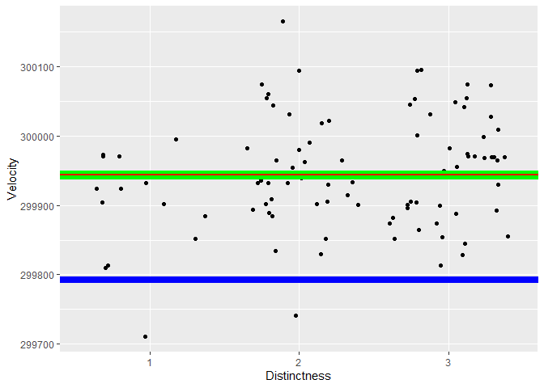
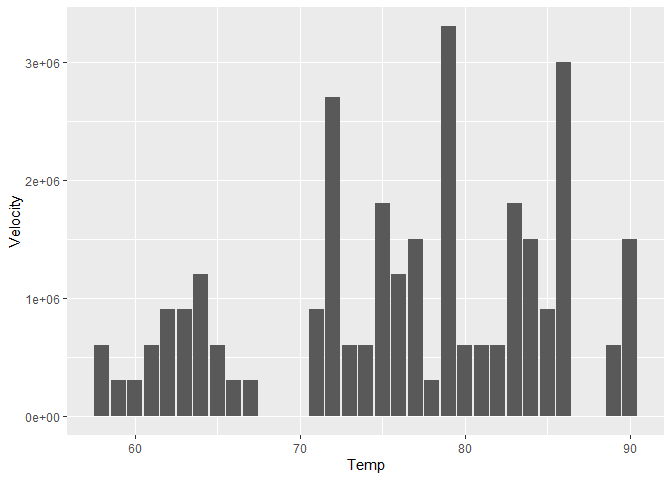

Michelson Speed-of-light Measurements
================
Amir Osorio
2020-2-11

- [Grading Rubric](#grading-rubric)
  - [Individual](#individual)
  - [Submission](#submission)
    - [**q1** Re-create the following table (from Michelson (1880),
      pg. 139) using `df_michelson` and `dplyr`. Note that your values
      *will not* match those of Michelson *exactly*; why might this
      be?](#q1-re-create-the-following-table-from-michelson-1880-pg-139-using-df_michelson-and-dplyr-note-that-your-values-will-not-match-those-of-michelson-exactly-why-might-this-be)
    - [**q2** Create a new variable `VelocityVacuum` with the $+92$ km/s
      adjustment to `Velocity`. Assign this new dataframe to
      `df_q2`.](#q2-create-a-new-variable-velocityvacuum-with-the-92-kms-adjustment-to-velocity-assign-this-new-dataframe-to-df_q2)
    - [**q3** Compare Michelson’s speed of light estimate against the
      modern speed of light value. Is Michelson’s estimate of the error
      (his uncertainty) greater or less than the true
      error?](#q3-compare-michelsons-speed-of-light-estimate-against-the-modern-speed-of-light-value-is-michelsons-estimate-of-the-error-his-uncertainty-greater-or-less-than-the-true-error)
    - [**q4** Inspect the following plot with the `Real` Michelson data
      and `Simulated` data from a probability model. Document the
      similarities and differences between the data under *observe*
      below.](#q4-inspect-the-following-plot-with-the-real-michelson-data-and-simulated-data-from-a-probability-model-document-the-similarities-and-differences-between-the-data-under-observe-below)
    - [**q5** You have access to a few other variables. Construct a **at
      least three** visualizations of `VelocityVacuum` against these
      other factors. Are there other patterns in the data that might
      help explain the difference between Michelson’s estimate and
      `LIGHTSPEED_VACUUM`?](#q5-you-have-access-to-a-few-other-variables-construct-a-at-least-three-visualizations-of-velocityvacuum-against-these-other-factors-are-there-other-patterns-in-the-data-that-might-help-explain-the-difference-between-michelsons-estimate-and-lightspeed_vacuum)
  - [Bibliography](#bibliography)

*Purpose*: When studying physical problems, there is an important
distinction between *error* and *uncertainty*. The primary purpose of
this challenge is to dip our toes into these factors by analyzing a real
dataset.

*Reading*: [Experimental Determination of the Velocity of
Light](https://play.google.com/books/reader?id=343nAAAAMAAJ&hl=en&pg=GBS.PA115)
(Optional)

<!-- include-rubric -->

# Grading Rubric

<!-- -------------------------------------------------- -->

Unlike exercises, **challenges will be graded**. The following rubrics
define how you will be graded, both on an individual and team basis.

## Individual

<!-- ------------------------- -->

| Category | Needs Improvement | Satisfactory |
|----|----|----|
| Effort | Some task **q**’s left unattempted | All task **q**’s attempted |
| Observed | Did not document observations, or observations incorrect | Documented correct observations based on analysis |
| Supported | Some observations not clearly supported by analysis | All observations clearly supported by analysis (table, graph, etc.) |
| Assessed | Observations include claims not supported by the data, or reflect a level of certainty not warranted by the data | Observations are appropriately qualified by the quality & relevance of the data and (in)conclusiveness of the support |
| Specified | Uses the phrase “more data are necessary” without clarification | Any statement that “more data are necessary” specifies which *specific* data are needed to answer what *specific* question |
| Code Styled | Violations of the [style guide](https://style.tidyverse.org/) hinder readability | Code sufficiently close to the [style guide](https://style.tidyverse.org/) |

## Submission

<!-- ------------------------- -->

Make sure to commit both the challenge report (`report.md` file) and
supporting files (`report_files/` folder) when you are done! Then submit
a link to Canvas. **Your Challenge submission is not complete without
all files uploaded to GitHub.**

``` r
# Libraries
library(tidyverse)
library(googlesheets4)

url <- "https://docs.google.com/spreadsheets/d/1av_SXn4j0-4Rk0mQFik3LLr-uf0YdA06i3ugE6n-Zdo/edit?usp=sharing"

# Parameters
LIGHTSPEED_VACUUM    <- 299792.458 # Exact speed of light in a vacuum (km / s)
LIGHTSPEED_MICHELSON <- 299944.00  # Michelson's speed estimate (km / s)
LIGHTSPEED_PM        <- 51         # Michelson error estimate (km / s)
```

*Background*: In 1879 Albert Michelson led an experimental campaign to
measure the speed of light. His approach was a development upon the
method of Foucault\[3\], and resulted in a new estimate of
$v_0 = 299944 \pm 51$ kilometers per second (in a vacuum). This is very
close to the modern *exact* value of 2.9979246^{5}. In this challenge,
you will analyze Michelson’s original data, and explore some of the
factors associated with his experiment.

I’ve already copied Michelson’s data from his 1880 publication; the code
chunk below will load these data from a public googlesheet.

*Aside*: The speed of light is *exact* (there is **zero error** in the
value `LIGHTSPEED_VACUUM`) because the meter is actually
[*defined*](https://en.wikipedia.org/wiki/Metre#Speed_of_light_definition)
in terms of the speed of light!

``` r
## Note: No need to edit this chunk!
gs4_deauth()
ss <- gs4_get(url)
df_michelson <-
  read_sheet(ss) %>%
  select(Date, Distinctness, Temp, Velocity) %>%
  mutate(Distinctness = as_factor(Distinctness))
```

    ## ✔ Reading from "michelson1879".

    ## ✔ Range 'Sheet1'.

``` r
df_michelson %>% glimpse()
```

    ## Rows: 100
    ## Columns: 4
    ## $ Date         <dttm> 1879-06-05, 1879-06-07, 1879-06-07, 1879-06-07, 1879-06-…
    ## $ Distinctness <fct> 3, 2, 2, 2, 2, 2, 3, 3, 3, 3, 2, 2, 2, 2, 2, 1, 3, 3, 2, …
    ## $ Temp         <dbl> 76, 72, 72, 72, 72, 72, 83, 83, 83, 83, 83, 90, 90, 71, 7…
    ## $ Velocity     <dbl> 299850, 299740, 299900, 300070, 299930, 299850, 299950, 2…

*Data dictionary*:

- `Date`: Date of measurement
- `Distinctness`: Distinctness of measured images: 3 = good, 2 = fair, 1
  = poor
- `Temp`: Ambient temperature (Fahrenheit)
- `Velocity`: Measured speed of light (km / s)

### **q1** Re-create the following table (from Michelson (1880), pg. 139) using `df_michelson` and `dplyr`. Note that your values *will not* match those of Michelson *exactly*; why might this be?

| Distinctness | n   | MeanVelocity |
|--------------|-----|--------------|
| 3            | 46  | 299860       |
| 2            | 39  | 299860       |
| 1            | 15  | 299810       |

``` r
## TODO: Compute summaries

df_q1 <- 
  df_michelson %>% 
  group_by(Distinctness) %>% 
  summarise( n =n() , MeanVelocity = mean(Velocity))

df_q1 %>%
  arrange(desc(Distinctness)) %>%
  knitr::kable()
```

| Distinctness |   n | MeanVelocity |
|:-------------|----:|-------------:|
| 3            |  46 |     299861.7 |
| 2            |  39 |     299858.5 |
| 1            |  15 |     299808.0 |

**Observations**: - Write your observations here!

One, I can see that the format in general is different, is in the table
that I made is dark and Im not sure how to make it another way. Second,
I notice that the values for the mean velocity are in decimal points, as
where in the table that I was tasked to recreate are whole number.

\- Why might your table differ from Michelson’s?

As I mentioned above the main difference is that of the data being in
decimal points, this is likely due to the fact that the table that I was
trying to recreate was rounded to the nearest whole number.

The `Velocity` values in the dataset are the speed of light *in air*;
Michelson introduced a couple of adjustments to estimate the speed of
light in a vacuum. In total, he added $+92$ km/s to his mean estimate
for `VelocityVacuum` (from Michelson (1880), pg. 141). While the
following isn’t fully rigorous ($+92$ km/s is based on the mean
temperature), we’ll simply apply this correction to all the observations
in the dataset.

### **q2** Create a new variable `VelocityVacuum` with the $+92$ km/s adjustment to `Velocity`. Assign this new dataframe to `df_q2`.

``` r
## TODO: Adjust the data, assign to df_q2
df_q2 <-
  df_michelson %>% 
  mutate(VelocityVacuum = Velocity + 92)
  

 df_q2
```

    ## # A tibble: 100 × 5
    ##    Date                Distinctness  Temp Velocity VelocityVacuum
    ##    <dttm>              <fct>        <dbl>    <dbl>          <dbl>
    ##  1 1879-06-05 00:00:00 3               76   299850         299942
    ##  2 1879-06-07 00:00:00 2               72   299740         299832
    ##  3 1879-06-07 00:00:00 2               72   299900         299992
    ##  4 1879-06-07 00:00:00 2               72   300070         300162
    ##  5 1879-06-07 00:00:00 2               72   299930         300022
    ##  6 1879-06-07 00:00:00 2               72   299850         299942
    ##  7 1879-06-09 00:00:00 3               83   299950         300042
    ##  8 1879-06-09 00:00:00 3               83   299980         300072
    ##  9 1879-06-09 00:00:00 3               83   299980         300072
    ## 10 1879-06-09 00:00:00 3               83   299880         299972
    ## # ℹ 90 more rows

As part of his study, Michelson assessed the various potential sources
of error, and provided his best-guess for the error in his
speed-of-light estimate. These values are provided in
`LIGHTSPEED_MICHELSON`—his nominal estimate—and
`LIGHTSPEED_PM`—plus/minus bounds on his estimate. Put differently,
Michelson believed the true value of the speed-of-light probably lay
between `LIGHTSPEED_MICHELSON - LIGHTSPEED_PM` and
`LIGHTSPEED_MICHELSON + LIGHTSPEED_PM`.

Let’s introduce some terminology:\[2\]

- **Error** is the difference between a true value and an estimate of
  that value; for instance `LIGHTSPEED_VACUUM - LIGHTSPEED_MICHELSON`.
- **Uncertainty** is an analyst’s *assessment* of the error.

Since a “true” value is often not known in practice, one generally does
not know the error. The best they can do is quantify their degree of
uncertainty. We will learn some means of quantifying uncertainty in this
class, but for many real problems uncertainty includes some amount of
human judgment.\[2\]

### **q3** Compare Michelson’s speed of light estimate against the modern speed of light value. Is Michelson’s estimate of the error (his uncertainty) greater or less than the true error?

``` r
## TODO: Compare Michelson's estimate and error against the true value
true_error = LIGHTSPEED_VACUUM - LIGHTSPEED_MICHELSON

abs(LIGHTSPEED_PM) < abs(true_error)
```

    ## [1] TRUE

``` r
abs(LIGHTSPEED_PM) - abs(true_error)
```

    ## [1] -100.542

``` r
true_error
```

    ## [1] -151.542

**Observations**: - Is Michelson’s estimate of the error (his
uncertainty) greater or less than the true error?

- In terms of magnitude, Michelson’s estimate of error was less that the
  magnitude of the true error.

- Make a quantitative comparison between Michelson’s uncertainty and his
  error.

When taking the absolute value of Michelson’s estimate of error, and the
absolute value of the true error, I found that the error that
Michelson’s estimate was less that that of the true value in magnitude.
.

The following plot shows all of Michelson’s data as a [control
chart](https://en.wikipedia.org/wiki/Control_chart); this sort of plot
is common in manufacturing, where it is used to help determine if a
manufacturing process is under [statistical
control](https://en.wikipedia.org/wiki/Statistical_process_control).
Each dot is one of Michelson’s measurements, and the grey line connects
the mean taken for each day. The same plot also shows simulated data
using a probability model. We’ll get into statistics later in the
course; for now, let’s focus on understanding what real and simulated
data tend to look like.

### **q4** Inspect the following plot with the `Real` Michelson data and `Simulated` data from a probability model. Document the similarities and differences between the data under *observe* below.

``` r
## Note: No need to edit this chunk!
## Calibrate simulated data
v_mean <-
  df_q2 %>%
  summarize(m = mean(VelocityVacuum)) %>%
  pull(m)
v_sd <-
  df_q2 %>%
  summarize(s = sd(VelocityVacuum)) %>%
  pull(s)

## Visualize
set.seed(101)
df_q2 %>%
  mutate(Simulated = rnorm(n(), mean = v_mean, sd = v_sd)) %>%
  rename(Real = VelocityVacuum) %>%
  pivot_longer(
    cols = c(Simulated, Real),
    names_to = "source",
    values_to = "velocity"
  ) %>%

  ggplot(aes(Date, velocity)) +
  geom_hline(
    yintercept = LIGHTSPEED_MICHELSON,
    linetype = "dotted"
  ) +
  geom_hline(
    yintercept = LIGHTSPEED_MICHELSON - LIGHTSPEED_PM,
    linetype = "dashed"
  ) +
  geom_hline(
    yintercept = LIGHTSPEED_MICHELSON + LIGHTSPEED_PM,
    linetype = "dashed"
  ) +

  geom_line(
    data = . %>%
      group_by(Date, source) %>%
      summarize(velocity_mean = mean(velocity)),
    mapping = aes(y = velocity_mean),
    color = "grey50"
  ) +
  geom_point(
    mapping = aes(y = velocity),
    size = 0.8
  ) +

  facet_grid(source~.) +
  theme_minimal() +
  labs(
    x = "Date of Measurement (1879)",
    y = "Velocity (in Vacuum)"
  )
```

    ## `summarise()` has grouped output by 'Date'. You can override using the
    ## `.groups` argument.

<!-- -->

**Observations**: Similarities - Overall, what I see that seem to be
similar between the real and simulated data are the dates in which the
data is plotted, obviously stating the fact that the data was recorded/
simulated during the same times. Another thing that is similar is the
fact that the median line for both of the plots have the same
“increments” in which they travel through the chart.

Differences - The differences that I noticed are the “slopes” for the
median lines and the positions in which the data is on the chart.

### **q5** You have access to a few other variables. Construct a **at least three** visualizations of `VelocityVacuum` against these other factors. Are there other patterns in the data that might help explain the difference between Michelson’s estimate and `LIGHTSPEED_VACUUM`?

**Observations**:

- Make sure to record observations on your graphs!

``` r
df_plot <- df_q2 %>%
  select(Distinctness, VelocityVacuum) %>%
  pivot_longer(cols = c(VelocityVacuum), values_to = "Velocity")

mean_velocity <- df_q2 %>%
  summarise(mean_val = mean(VelocityVacuum)) %>%
  pull(mean_val)

ggplot(df_plot, aes(x = Distinctness, y = Velocity)) +
  geom_jitter() +
  geom_abline(slope = 0, intercept = mean_velocity, col = "Green", size = 4) +
  geom_abline(slope = 0, intercept = LIGHTSPEED_VACUUM, col = "blue", size = 3) +
  geom_abline(slope = 0, intercept = LIGHTSPEED_MICHELSON, col = "red", size = 1) 
```

    ## Warning: Using `size` aesthetic for lines was deprecated in ggplot2 3.4.0.
    ## ℹ Please use `linewidth` instead.
    ## This warning is displayed once every 8 hours.
    ## Call `lifecycle::last_lifecycle_warnings()` to see where this warning was
    ## generated.

<!-- -->

**Observations**:

- Here I have a “jitter” plot of Velocity Vacuum vs Distinctness. I have
  also included horizontal lines that describe the following:
  - BLUE LINE —– Exact Speed of light in a Vacuum
  - RED LINE —– Mean Value of Michelson’s Speed of light in a Vacuum
    Data
  - GREEN LINE —– Michelson’s Speed of light in a Vacuum
- After taking the mean of the data that Michelson represented by the
  (RED LINE), we can see that it is very similar to Michelson Speed of
  light value (GREEN LINE). When we compare these two lines to that of
  the Exact Speed of light value (BLUE LINE) we can see that they are in
  two different places suggesting that they are different in value. This
  raises the question on why this value might be different, my
  suggestion (and understanding after doing some research as well) is
  that their might have been some wrong with the way that Michleson
  actually recorded his data , causing his data overall to be different
  then that of the modern day recording of the data.

``` r
df_plot <- df_q2 %>%
  select(Temp, VelocityVacuum) %>%
  pivot_longer(cols = c(VelocityVacuum), values_to = "Velocity")

ggplot(df_plot, aes(x = Temp, y = Velocity)) +
  geom_col()
```

<!-- -->

**Observations**:

- In this graph, I have VelocityVacuum vs Temperature in a Column Chart.
  As you can see, we have some clear distinction between the lower
  temperatures and the higher temperatures, this coming from the fact
  that in the higher temperature range we see higher VelocityVacuum
  values. From my intent in trying to interpret this , I suggest that
  the warmer temperature allowed for better day conditions, this then
  allowing for the collection of the data to be significantly easier(
  which could have an effect on the overall test data he recorded,
  causing a difference in the true light speed and Michelsons estimate).
  In the reading thatw as optional for his experiment , it was described
  that in his initial experiment , he utilized sun rays, further
  solidifying why the sun/temperature might have played a part in this
  Phenomenon.

``` r
df_plot <- df_q2 %>%
  select(Date, VelocityVacuum) %>%
  pivot_longer(cols = c(VelocityVacuum), values_to = "Velocity")

ggplot(df_plot, aes(x = Date, y = Velocity)) +
  geom_smooth()
```

    ## `geom_smooth()` using method = 'loess' and formula = 'y ~ x'

<!-- -->

**Observations**:

- Here I have a visualization of the relationship between the Velocity
  Vacuum and the Data that the data points were recorded. As we move
  from the beginning of June to the end of June, we can see this
  decline/decrease in the recorded value of Velocity Vacuum. This can
  likely be explained by the location of where he initially recorded his
  data, The United States Naval Academy in Maryland. Typically in June,
  marks the time where summer begins in the northern hemisphere ,
  meaning that temperatures rise due to higher intensity of the Suns
  Rays. As the experiment reading describes the fact that the Suns Rays
  we initially used as a light sources for the experiment, and the suns
  intensity started picking up during this , this may explain why we see
  a higher variability in the earlier stages in the month, and then
  being to stay at more of a steady range at the end of the month due to
  more of a concentration of the Suns rays.

## Bibliography

- \[1\] Michelson, [Experimental Determination of the Velocity of
  Light](https://play.google.com/books/reader?id=343nAAAAMAAJ&hl=en&pg=GBS.PA115)
  1880) 
- \[2\] Henrion and Fischhoff, [Assessing Uncertainty in Physical
  Constants](https://www.cmu.edu/epp/people/faculty/research/Fischoff-Henrion-Assessing%20uncertainty%20in%20physical%20constants.pdf)
  1986) 
- \[3\] BYU video about a [Fizeau-Foucault
  apparatus](https://www.youtube.com/watch?v=Ik5ORaaeaME), similar to
  what Michelson used.
