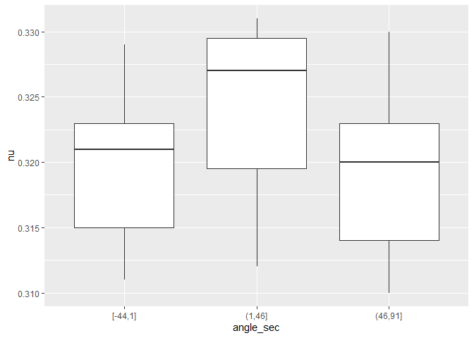
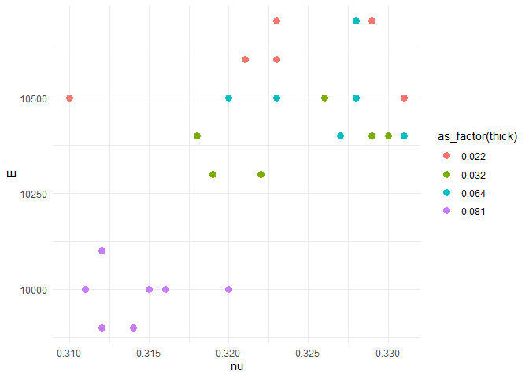

Aluminum Data
================
(Your name here)
2020-

- [Grading Rubric](#grading-rubric)
  - [Individual](#individual)
  - [Submission](#submission)
- [Loading and Wrangle](#loading-and-wrangle)
  - [**q1** Tidy `df_stang` to produce `df_stang_long`. You should have
    column names `thick, alloy, angle, E, nu`. Make sure the `angle`
    variable is of correct type. Filter out any invalid
    values.](#q1-tidy-df_stang-to-produce-df_stang_long-you-should-have-column-names-thick-alloy-angle-e-nu-make-sure-the-angle-variable-is-of-correct-type-filter-out-any-invalid-values)
- [EDA](#eda)
  - [Initial checks](#initial-checks)
    - [**q2** Perform a basic EDA on the aluminum data *without
      visualization*. Use your analysis to answer the questions under
      *observations* below. In addition, add your own *specific*
      question that you’d like to answer about the data—you’ll answer it
      below in
      q3.](#q2-perform-a-basic-eda-on-the-aluminum-data-without-visualization-use-your-analysis-to-answer-the-questions-under-observations-below-in-addition-add-your-own-specific-question-that-youd-like-to-answer-about-the-datayoull-answer-it-below-in-q3)
  - [Visualize](#visualize)
    - [**q3** Create a visualization to investigate your question from
      q2 above. Can you find an answer to your question using the
      dataset? Would you need additional information to answer your
      question?](#q3-create-a-visualization-to-investigate-your-question-from-q2-above-can-you-find-an-answer-to-your-question-using-the-dataset-would-you-need-additional-information-to-answer-your-question)
    - [**q4** Consider the following
      statement:](#q4-consider-the-following-statement)
- [References](#references)

*Purpose*: When designing structures such as bridges, boats, and planes,
the design team needs data about *material properties*. Often when we
engineers first learn about material properties through coursework, we
talk about abstract ideas and look up values in tables without ever
looking at the data that gave rise to published properties. In this
challenge you’ll study an aluminum alloy dataset: Studying these data
will give you a better sense of the challenges underlying published
material values.

In this challenge, you will load a real dataset, wrangle it into tidy
form, and perform EDA to learn more about the data.

<!-- include-rubric -->

# Grading Rubric

<!-- -------------------------------------------------- -->

Unlike exercises, **challenges will be graded**. The following rubrics
define how you will be graded, both on an individual and team basis.

## Individual

<!-- ------------------------- -->

| Category | Needs Improvement | Satisfactory |
|----|----|----|
| Effort | Some task **q**’s left unattempted | All task **q**’s attempted |
| Observed | Did not document observations, or observations incorrect | Documented correct observations based on analysis |
| Supported | Some observations not clearly supported by analysis | All observations clearly supported by analysis (table, graph, etc.) |
| Assessed | Observations include claims not supported by the data, or reflect a level of certainty not warranted by the data | Observations are appropriately qualified by the quality & relevance of the data and (in)conclusiveness of the support |
| Specified | Uses the phrase “more data are necessary” without clarification | Any statement that “more data are necessary” specifies which *specific* data are needed to answer what *specific* question |
| Code Styled | Violations of the [style guide](https://style.tidyverse.org/) hinder readability | Code sufficiently close to the [style guide](https://style.tidyverse.org/) |

## Submission

<!-- ------------------------- -->

Make sure to commit both the challenge report (`report.md` file) and
supporting files (`report_files/` folder) when you are done! Then submit
a link to Canvas. **Your Challenge submission is not complete without
all files uploaded to GitHub.**

``` r
library(tidyverse)
```

    ## ── Attaching core tidyverse packages ──────────────────────── tidyverse 2.0.0 ──
    ## ✔ dplyr     1.1.4     ✔ readr     2.1.5
    ## ✔ forcats   1.0.0     ✔ stringr   1.5.1
    ## ✔ ggplot2   3.5.1     ✔ tibble    3.2.1
    ## ✔ lubridate 1.9.4     ✔ tidyr     1.3.1
    ## ✔ purrr     1.0.2     
    ## ── Conflicts ────────────────────────────────────────── tidyverse_conflicts() ──
    ## ✖ dplyr::filter() masks stats::filter()
    ## ✖ dplyr::lag()    masks stats::lag()
    ## ℹ Use the conflicted package (<http://conflicted.r-lib.org/>) to force all conflicts to become errors

*Background*: In 1946, scientists at the Bureau of Standards tested a
number of Aluminum plates to determine their
[elasticity](https://en.wikipedia.org/wiki/Elastic_modulus) and
[Poisson’s ratio](https://en.wikipedia.org/wiki/Poisson%27s_ratio).
These are key quantities used in the design of structural members, such
as aircraft skin under [buckling
loads](https://en.wikipedia.org/wiki/Buckling). These scientists tested
plats of various thicknesses, and at different angles with respect to
the [rolling](https://en.wikipedia.org/wiki/Rolling_(metalworking))
direction.

# Loading and Wrangle

<!-- -------------------------------------------------- -->

The `readr` package in the Tidyverse contains functions to load data
form many sources. The `read_csv()` function will help us load the data
for this challenge.

``` r
## NOTE: If you extracted all challenges to the same location,
## you shouldn't have to change this filename
filename <- "./data/stang.csv"

## Load the data
df_stang <- read_csv(filename)
```

    ## Rows: 9 Columns: 8
    ## ── Column specification ────────────────────────────────────────────────────────
    ## Delimiter: ","
    ## chr (1): alloy
    ## dbl (7): thick, E_00, nu_00, E_45, nu_45, E_90, nu_90
    ## 
    ## ℹ Use `spec()` to retrieve the full column specification for this data.
    ## ℹ Specify the column types or set `show_col_types = FALSE` to quiet this message.

``` r
df_stang
```

    ## # A tibble: 9 × 8
    ##   thick  E_00 nu_00  E_45  nu_45  E_90 nu_90 alloy  
    ##   <dbl> <dbl> <dbl> <dbl>  <dbl> <dbl> <dbl> <chr>  
    ## 1 0.022 10600 0.321 10700  0.329 10500 0.31  al_24st
    ## 2 0.022 10600 0.323 10500  0.331 10700 0.323 al_24st
    ## 3 0.032 10400 0.329 10400  0.318 10300 0.322 al_24st
    ## 4 0.032 10300 0.319 10500  0.326 10400 0.33  al_24st
    ## 5 0.064 10500 0.323 10400  0.331 10400 0.327 al_24st
    ## 6 0.064 10700 0.328 10500  0.328 10500 0.32  al_24st
    ## 7 0.081 10000 0.315 10000  0.32   9900 0.314 al_24st
    ## 8 0.081 10100 0.312  9900  0.312 10000 0.316 al_24st
    ## 9 0.081 10000 0.311    -1 -1      9900 0.314 al_24st

Note that these data are not tidy! The data in this form are convenient
for reporting in a table, but are not ideal for analysis.

### **q1** Tidy `df_stang` to produce `df_stang_long`. You should have column names `thick, alloy, angle, E, nu`. Make sure the `angle` variable is of correct type. Filter out any invalid values.

*Hint*: You can reshape in one `pivot` using the `".value"` special
value for `names_to`.

``` r
## TASK: Tidy `df_stang`
df_stang_long <-
  df_stang %>% 
  pivot_longer(
    names_to = c(".value", "angle"),
    names_sep = "_",
    cols = c(-thick, -alloy)
  ) %>% 
  filter (E>0) %>% 
  transform(angle = as.integer(angle))

df_stang_long
```

    ##    thick   alloy angle     E    nu
    ## 1  0.022 al_24st     0 10600 0.321
    ## 2  0.022 al_24st    45 10700 0.329
    ## 3  0.022 al_24st    90 10500 0.310
    ## 4  0.022 al_24st     0 10600 0.323
    ## 5  0.022 al_24st    45 10500 0.331
    ## 6  0.022 al_24st    90 10700 0.323
    ## 7  0.032 al_24st     0 10400 0.329
    ## 8  0.032 al_24st    45 10400 0.318
    ## 9  0.032 al_24st    90 10300 0.322
    ## 10 0.032 al_24st     0 10300 0.319
    ## 11 0.032 al_24st    45 10500 0.326
    ## 12 0.032 al_24st    90 10400 0.330
    ## 13 0.064 al_24st     0 10500 0.323
    ## 14 0.064 al_24st    45 10400 0.331
    ## 15 0.064 al_24st    90 10400 0.327
    ## 16 0.064 al_24st     0 10700 0.328
    ## 17 0.064 al_24st    45 10500 0.328
    ## 18 0.064 al_24st    90 10500 0.320
    ## 19 0.081 al_24st     0 10000 0.315
    ## 20 0.081 al_24st    45 10000 0.320
    ## 21 0.081 al_24st    90  9900 0.314
    ## 22 0.081 al_24st     0 10100 0.312
    ## 23 0.081 al_24st    45  9900 0.312
    ## 24 0.081 al_24st    90 10000 0.316
    ## 25 0.081 al_24st     0 10000 0.311
    ## 26 0.081 al_24st    90  9900 0.314

Use the following tests to check your work.

``` r
## NOTE: No need to change this
## Names
assertthat::assert_that(
              setequal(
                df_stang_long %>% names,
                c("thick", "alloy", "angle", "E", "nu")
              )
            )
```

    ## [1] TRUE

``` r
## Dimensions
assertthat::assert_that(all(dim(df_stang_long) == c(26, 5)))
```

    ## [1] TRUE

``` r
## Type
assertthat::assert_that(
              (df_stang_long %>% pull(angle) %>% typeof()) == "integer"
            )
```

    ## [1] TRUE

``` r
print("Very good!")
```

    ## [1] "Very good!"

# EDA

<!-- -------------------------------------------------- -->

## Initial checks

<!-- ------------------------- -->

### **q2** Perform a basic EDA on the aluminum data *without visualization*. Use your analysis to answer the questions under *observations* below. In addition, add your own *specific* question that you’d like to answer about the data—you’ll answer it below in q3.

``` r
# This data set is based on the experiment of scientists at the Bureau of Standards who tested a number of Aluminum plates to determine their material properties in 1946. After tidying up the data set to make it much easier to read, we are left with the following information/columns:

# Thick - The thickness of the sample piece.
# Alloy - the certain mixture of the chemical compound that makes up the sample piece.
# Angle - the respective angle measurement in which the sample was experimented under.
# E - Elasticity (the value which describes the materials ability to be distorted and ability to return to its original state.)
# nu -  Poisson's Ratio (the value which describes the deformation of a material in directions perpendicular to the specific direction of loading.)

# The following data set looks particularly in to the "al_24st" with all other properties including thickness, Elasticity, Poisson's ratio, and angle varying to the specific experiment.

# As we can see from the data there is no one "true" values from the data, for the properties of the aluminum that was used.

# the angles that we tested did vary but included the angles 0, 45, and 90.

# The thicknesses also varied, but stayed within the range of 0.022 and 0.081.

# A question that I would like to answer given this data set is "At what angle is the recorded poissons ratio the highest in general?"
```

**Observations**:

- Is there “one true value” for the material properties of Aluminum?
  - As we can see from the data there is no one “true” values from the
    data, for the properties of the aluminum that was used.
- How many aluminum alloys are in this dataset? How do you know?
  - The following data set looks particularly in to the “al_24st” in all
    tests, so one alloy.
- What angles were tested?
  - The angles that we tested did vary but included the angles 0, 45,
    and 90.
- What thicknesses were tested?
  - The thicknesses that were tested were within the range of 0.022 and
    0.081.
- A question that I would like to answer given this data set is “At what
  angle is the recorded poissons ratio the highest in general?”

## Visualize

<!-- ------------------------- -->

### **q3** Create a visualization to investigate your question from q2 above. Can you find an answer to your question using the dataset? Would you need additional information to answer your question?

``` r
## TASK: Investigate your question from q1 here
df_stang_long %>%
  mutate(angle_sec = cut_width(angle, width = 45, boundary = 1)) %>%
  ggplot(aes(x = angle_sec, y = nu)) +
  geom_boxplot()
```

<!-- -->

**Observations**:

- Looking at the box plot above, we can see a pretty good representation
  of the different angles and the general range of the recorded values
  of poissons ratio. Looking at the median values for the different
  angles, we can see that the box with the highest median value for the
  poissons ratio is that of 45.

### **q4** Consider the following statement:

> “A material’s property (or material property) is an intensive property
> of some material, i.e. a physical property that does not depend on the
> amount of the material.”\[2\]

Note that the “amount of material” would vary with the thickness of a
tested plate. Does the following graph support or contradict the claim
that “elasticity `E` is an intensive material property.” Why or why not?
Is this evidence *conclusive* one way or another? Why or why not?

``` r
## NOTE: No need to change; run this chunk
df_stang_long %>%

  ggplot(aes(nu, E, color = as_factor(thick))) +
  geom_point(size = 3) +
  theme_minimal()
```

<!-- -->

**Observations**:

- Does this graph support or contradict the claim above?
  - The graph sort of contradicts this claim, mainly because different
    thicknesses are at different areas of E. For example, the thickness
    0.081 in generally on the bottom left of the graph in terms of
    elasticity while when compared with the thickness 0.022, we can see
    that it generally is around the top right corner of the graph,
    signaling that it has a higher E.
- Is this evidence *conclusive* one way or another?
  - From the way this graph is plotted, it concludes that thickness does
    have an effect on elasticity based on the varying levels of
    elasticity and the positioning of the colors representing those
    thickness’s.

# References

<!-- -------------------------------------------------- -->

\[1\] Stang, Greenspan, and Newman, “Poisson’s ratio of some structural
alloys for large strains” (1946) Journal of Research of the National
Bureau of Standards, (pdf
link)\[<https://nvlpubs.nist.gov/nistpubs/jres/37/jresv37n4p211_A1b.pdf>\]

\[2\] Wikipedia, *List of material properties*, accessed 2020-06-26,
(link)\[<https://en.wikipedia.org/wiki/List_of_materials_properties>\]
