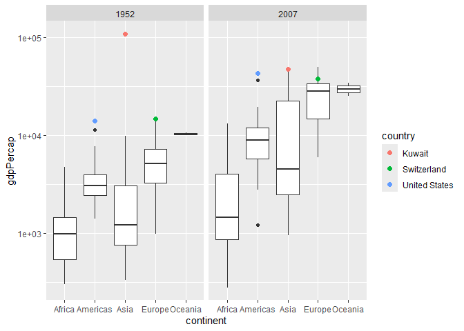

Gapminder
================
Amir Osorio
2025-04-13

- [Grading Rubric](#grading-rubric)
  - [Individual](#individual)
  - [Submission](#submission)
- [Guided EDA](#guided-eda)
  - [**q0** Perform your “first checks” on the dataset. What variables
    are in
    this](#q0-perform-your-first-checks-on-the-dataset-what-variables-are-in-this)
  - [**q1** Determine the most and least recent years in the `gapminder`
    dataset.](#q1-determine-the-most-and-least-recent-years-in-the-gapminder-dataset)
  - [**q2** Filter on years matching `year_min`, and make a plot of the
    GDP per capita against continent. Choose an appropriate `geom_` to
    visualize the data. What observations can you
    make?](#q2-filter-on-years-matching-year_min-and-make-a-plot-of-the-gdp-per-capita-against-continent-choose-an-appropriate-geom_-to-visualize-the-data-what-observations-can-you-make)
  - [**q3** You should have found *at least* three outliers in q2 (but
    possibly many more!). Identify those outliers (figure out which
    countries they
    are).](#q3-you-should-have-found-at-least-three-outliers-in-q2-but-possibly-many-more-identify-those-outliers-figure-out-which-countries-they-are)
  - [**q4** Create a plot similar to yours from q2 studying both
    `year_min` and `year_max`. Find a way to highlight the outliers from
    q3 on your plot *in a way that lets you identify which country is
    which*. Compare the patterns between `year_min` and
    `year_max`.](#q4-create-a-plot-similar-to-yours-from-q2-studying-both-year_min-and-year_max-find-a-way-to-highlight-the-outliers-from-q3-on-your-plot-in-a-way-that-lets-you-identify-which-country-is-which-compare-the-patterns-between-year_min-and-year_max)
- [Your Own EDA](#your-own-eda)
  - [**q5** Create *at least* three new figures below. With each figure,
    try to pose new questions about the
    data.](#q5-create-at-least-three-new-figures-below-with-each-figure-try-to-pose-new-questions-about-the-data)

*Purpose*: Learning to do EDA well takes practice! In this challenge
you’ll further practice EDA by first completing a guided exploration,
then by conducting your own investigation. This challenge will also give
you a chance to use the wide variety of visual tools we’ve been
learning.

<!-- include-rubric -->

# Grading Rubric

<!-- -------------------------------------------------- -->

Unlike exercises, **challenges will be graded**. The following rubrics
define how you will be graded, both on an individual and team basis.

## Individual

<!-- ------------------------- -->

| Category | Needs Improvement | Satisfactory |
|----|----|----|
| Effort | Some task **q**’s left unattempted | All task **q**’s attempted |
| Observed | Did not document observations, or observations incorrect | Documented correct observations based on analysis |
| Supported | Some observations not clearly supported by analysis | All observations clearly supported by analysis (table, graph, etc.) |
| Assessed | Observations include claims not supported by the data, or reflect a level of certainty not warranted by the data | Observations are appropriately qualified by the quality & relevance of the data and (in)conclusiveness of the support |
| Specified | Uses the phrase “more data are necessary” without clarification | Any statement that “more data are necessary” specifies which *specific* data are needed to answer what *specific* question |
| Code Styled | Violations of the [style guide](https://style.tidyverse.org/) hinder readability | Code sufficiently close to the [style guide](https://style.tidyverse.org/) |

## Submission

<!-- ------------------------- -->

Make sure to commit both the challenge report (`report.md` file) and
supporting files (`report_files/` folder) when you are done! Then submit
a link to Canvas. **Your Challenge submission is not complete without
all files uploaded to GitHub.**

``` r
library(tidyverse)
```

    ## ── Attaching core tidyverse packages ──────────────────────── tidyverse 2.0.0 ──
    ## ✔ dplyr     1.1.4     ✔ readr     2.1.5
    ## ✔ forcats   1.0.0     ✔ stringr   1.5.1
    ## ✔ ggplot2   3.5.1     ✔ tibble    3.2.1
    ## ✔ lubridate 1.9.4     ✔ tidyr     1.3.1
    ## ✔ purrr     1.0.2     
    ## ── Conflicts ────────────────────────────────────────── tidyverse_conflicts() ──
    ## ✖ dplyr::filter() masks stats::filter()
    ## ✖ dplyr::lag()    masks stats::lag()
    ## ℹ Use the conflicted package (<http://conflicted.r-lib.org/>) to force all conflicts to become errors

``` r
library(gapminder)
```

*Background*: [Gapminder](https://www.gapminder.org/about-gapminder/) is
an independent organization that seeks to educate people about the state
of the world. They seek to counteract the worldview constructed by a
hype-driven media cycle, and promote a “fact-based worldview” by
focusing on data. The dataset we’ll study in this challenge is from
Gapminder.

# Guided EDA

<!-- -------------------------------------------------- -->

First, we’ll go through a round of *guided EDA*. Try to pay attention to
the high-level process we’re going through—after this guided round
you’ll be responsible for doing another cycle of EDA on your own!

### **q0** Perform your “first checks” on the dataset. What variables are in this

dataset?

``` r
## TASK: Do your "first checks" here!

glimpse(gapminder)
```

    ## Rows: 1,704
    ## Columns: 6
    ## $ country   <fct> "Afghanistan", "Afghanistan", "Afghanistan", "Afghanistan", …
    ## $ continent <fct> Asia, Asia, Asia, Asia, Asia, Asia, Asia, Asia, Asia, Asia, …
    ## $ year      <int> 1952, 1957, 1962, 1967, 1972, 1977, 1982, 1987, 1992, 1997, …
    ## $ lifeExp   <dbl> 28.801, 30.332, 31.997, 34.020, 36.088, 38.438, 39.854, 40.8…
    ## $ pop       <int> 8425333, 9240934, 10267083, 11537966, 13079460, 14880372, 12…
    ## $ gdpPercap <dbl> 779.4453, 820.8530, 853.1007, 836.1971, 739.9811, 786.1134, …

**Observations**:

-The variables are country, continent, year, lifeExp, pop, gdpPercap.
The countries and continents both seem to be in alphabetical order as
well.

### **q1** Determine the most and least recent years in the `gapminder` dataset.

*Hint*: Use the `pull()` function to get a vector out of a tibble.
(Rather than the `$` notation of base R.)

``` r
## TASK: Find the largest and smallest values of `year` in `gapminder`
year_max <- 
  gapminder %>% 
  pull(year) %>%
  max()

year_min <- 
  gapminder %>% 
  pull(year) %>%
  min()
```

Use the following test to check your work.

``` r
## NOTE: No need to change this
assertthat::assert_that(year_max %% 7 == 5)
```

    ## [1] TRUE

``` r
assertthat::assert_that(year_max %% 3 == 0)
```

    ## [1] TRUE

``` r
assertthat::assert_that(year_min %% 7 == 6)
```

    ## [1] TRUE

``` r
assertthat::assert_that(year_min %% 3 == 2)
```

    ## [1] TRUE

``` r
if (is_tibble(year_max)) {
  print("year_max is a tibble; try using `pull()` to get a vector")
  assertthat::assert_that(False)
}

print("Nice!")
```

    ## [1] "Nice!"

### **q2** Filter on years matching `year_min`, and make a plot of the GDP per capita against continent. Choose an appropriate `geom_` to visualize the data. What observations can you make?

You may encounter difficulties in visualizing these data; if so document
your challenges and attempt to produce the most informative visual you
can.

``` r
## TASK: Create a visual of gdpPercap vs continent

df_year_ymin <-
  filter(gapminder, year == year_min)


df_year_ymin %>% 
  ggplot(aes(continent, gdpPercap)) +
  geom_boxplot() +
  scale_y_log10()
```

<!-- -->

**Observations**:

- As we can see with the following box plot, there are a couple of
  outliers. We can make the observation that at this point in time,
  there in a country in Asia that has an extremely high GDP. We also
  notice that Africa host some of the lowest GDPs based on its position
  being so low. **Difficulties & Approaches**:

- When trying to find a medium which I thought was suitable for this
  data, I ran into the problem that not every medium was the best to
  showcase the data. I original tried a histogram which did not seem to
  exactly portray the data in the best manner, which is why I went with
  the box plot, which gives a good picture of the data, including the
  outliers as well. Another problem that I ran into was the fact that
  the outlier for the continent of Asia was so high that it essentially
  warped the graph. Now with the added log log scale it is easier to
  understand than with a regular scale.

### **q3** You should have found *at least* three outliers in q2 (but possibly many more!). Identify those outliers (figure out which countries they are).

``` r
## TASK: Identify the outliers from q2

df_asia_ymin <-
  df_year_ymin %>% 
  select(everything())

df_europe_ymin <-
  df_year_ymin %>% 
  select(everything())

df_americas_ymin <-
  df_year_ymin %>% 
  select(everything())


asia_max_gdp_ymin <-
  df_asia_ymin %>%
  filter(continent == "Asia") %>%
  filter(gdpPercap == max(gdpPercap))

europe_max_gdp_ymin <-
  df_europe_ymin %>%
  filter(continent == "Europe") %>%
  filter(gdpPercap == max(gdpPercap))

americas_max_gdp_ymin <-
  df_europe_ymin %>%
  filter(continent == "Americas") %>%
  filter(gdpPercap == max(gdpPercap))


asia_max_gdp_ymin
```

    ## # A tibble: 1 × 6
    ##   country continent  year lifeExp    pop gdpPercap
    ##   <fct>   <fct>     <int>   <dbl>  <int>     <dbl>
    ## 1 Kuwait  Asia       1952    55.6 160000   108382.

``` r
europe_max_gdp_ymin
```

    ## # A tibble: 1 × 6
    ##   country     continent  year lifeExp     pop gdpPercap
    ##   <fct>       <fct>     <int>   <dbl>   <int>     <dbl>
    ## 1 Switzerland Europe     1952    69.6 4815000    14734.

``` r
americas_max_gdp_ymin
```

    ## # A tibble: 1 × 6
    ##   country       continent  year lifeExp       pop gdpPercap
    ##   <fct>         <fct>     <int>   <dbl>     <int>     <dbl>
    ## 1 United States Americas   1952    68.4 157553000    13990.

**Observations**:

- Identify the outlier countries from q2
  - Here, I have made 3 tibbles showing the highest GDP’s for the
    continents of Asia, Europe, and the Americas. The countries with
    their respective continents are as follows: Asia —\> Kuwait Europe
    —\> Switzerland Americas —\> United States

*Hint*: For the next task, it’s helpful to know a ggplot trick we’ll
learn in an upcoming exercise: You can use the `data` argument inside
any `geom_*` to modify the data that will be plotted *by that geom
only*. For instance, you can use this trick to filter a set of points to
label:

``` r
## NOTE: No need to edit, use ideas from this in q4 below
gapminder %>%
  filter(year == max(year)) %>%

  ggplot(aes(continent, lifeExp)) +
  geom_boxplot() +
  geom_point(
    data = . %>% filter(country %in% c("United Kingdom", "Japan", "Zambia")),
    mapping = aes(color = country),
    size = 3
  ) + 
  scale_y_log10()
```

<!-- -->

### **q4** Create a plot similar to yours from q2 studying both `year_min` and `year_max`. Find a way to highlight the outliers from q3 on your plot *in a way that lets you identify which country is which*. Compare the patterns between `year_min` and `year_max`.

*Hint*: We’ve learned a lot of different ways to show multiple
variables; think about using different aesthetics or facets.

``` r
## TASK: Create a visual of gdpPercap vs continent

gapminder %>%
  filter(year %in% c(min(year), max(year))) %>%

  ggplot(aes(continent, gdpPercap)) +
  geom_boxplot() +
  geom_point(
    data = . %>% filter(country %in% c("Kuwait", "Switzerland", "United States")),
    mapping = aes(color = country),
    size = 3
  ) +
facet_wrap(~year) + 
  scale_y_log10()
```

<!-- -->

**Observations**:

- As we can see, a grand majority of continents, or countries for that
  matter, have had an increase in their GDP’s. What was most surprising
  however is the fact that the country who previously had the highest
  GDP’s for the year 1952 dramatically decreased in the year
  2007.Although it still seems to have the highest GDP in 2007, it makes
  you think about what cause this to happen, or what cause for such a
  strong decrease in the country’s GDP’s.

# Your Own EDA

<!-- -------------------------------------------------- -->

Now it’s your turn! We just went through guided EDA considering the GDP
per capita at two time points. You can continue looking at outliers,
consider different years, repeat the exercise with `lifeExp`, consider
the relationship between variables, or something else entirely.

### **q5** Create *at least* three new figures below. With each figure, try to pose new questions about the data.

``` r
gapminder %>% 
  group_by(continent, year) %>% 
  mutate(median_gpd = median(gdpPercap)) %>%
  ggplot(aes(x = year, y = median_gpd, color = continent)) +
geom_line()
```

<!-- -->

-Here I have a line graph of median GDP vs time (Years) for each
continent. As we can see, most of the continents have had somewhat of a
rise in median GDP, however, we can see a very nice rise in median GDP
for Oceania and Europe.

Seeing this, the question that I would like to ask is as follows:

“What event might have cause for this rise in median GDP for Oceania and
Europe, but not for Asia, Africa or the Americas ?”

``` r
## TASK: Your second graph
gapminder %>% 
  group_by(continent, year) %>% 
  mutate(median_lifeexp = median(lifeExp)) %>%
  ggplot(aes(x = year, y = median_lifeexp, color = continent)) +
geom_line()
```

<!-- -->

- Here I have a line graph of median life expectancy vs time (Years). We
  can mostly see growing trends for each continent. Around the year 2003
  we can see a slight decrease in Africa population. With this
  observation in mind, I would like to ask the following question:

“Why is it that Africa experienced the harshest decline in median life
expectancy then the other continents?”

``` r
## TASK: Your third graph
gapminder %>% 
  group_by(continent, year) %>% 
  mutate(median_pop = median(pop)) %>%
  ggplot(aes(x = year, y = median_pop, color = continent)) +
geom_line() 
```

<!-- -->

- Here I have yet another line plot showcasing the median population vs
  time (years). Here we can see that almost every country has somewhat
  of an increase. While Europe seems to have the least growth in terms
  of population, Asia on the other hand almost has this exponential
  curve going on .

With this in mind I would like to ask the following question:

“What country in Asia is contributing the most to such exponential
growth in median population?”
