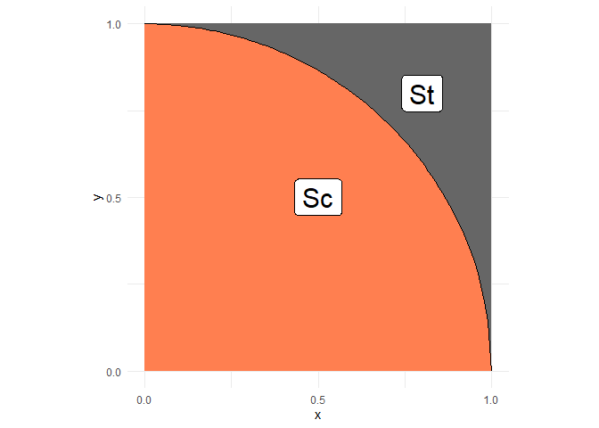
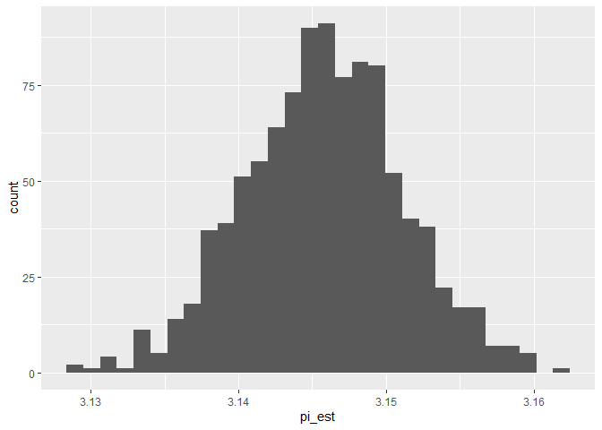

*Purpose*: Random sampling is extremely powerful. To build more
intuition for how we can use random sampling to solve problems, we’ll
tackle what—at first blush—doesn’t seem appropriate for a random
approach: estimating fundamental deterministic constants. In this
challenge you’ll work through an example of turning a deterministic
problem into a random sampling problem, and practice quantifying
uncertainty in your estimate.

<!-- include-rubric -->

# Grading Rubric

<!-- -------------------------------------------------- -->

Unlike exercises, **challenges will be graded**. The following rubrics
define how you will be graded, both on an individual and team basis.

## Individual

<!-- ------------------------- -->

<table>
<colgroup>
<col style="width: 33%" />
<col style="width: 33%" />
<col style="width: 33%" />
</colgroup>
<thead>
<tr class="header">
<th>Category</th>
<th>Needs Improvement</th>
<th>Satisfactory</th>
</tr>
</thead>
<tbody>
<tr class="odd">
<td>Effort</td>
<td>Some task <strong>q</strong>’s left unattempted</td>
<td>All task <strong>q</strong>’s attempted</td>
</tr>
<tr class="even">
<td>Observed</td>
<td>Did not document observations, or observations incorrect</td>
<td>Documented correct observations based on analysis</td>
</tr>
<tr class="odd">
<td>Supported</td>
<td>Some observations not clearly supported by analysis</td>
<td>All observations clearly supported by analysis (table, graph,
etc.)</td>
</tr>
<tr class="even">
<td>Assessed</td>
<td>Observations include claims not supported by the data, or reflect a
level of certainty not warranted by the data</td>
<td>Observations are appropriately qualified by the quality &amp;
relevance of the data and (in)conclusiveness of the support</td>
</tr>
<tr class="odd">
<td>Specified</td>
<td>Uses the phrase “more data are necessary” without clarification</td>
<td>Any statement that “more data are necessary” specifies which
<em>specific</em> data are needed to answer what <em>specific</em>
question</td>
</tr>
<tr class="even">
<td>Code Styled</td>
<td>Violations of the <a href="https://style.tidyverse.org/">style
guide</a> hinder readability</td>
<td>Code sufficiently close to the <a
href="https://style.tidyverse.org/">style guide</a></td>
</tr>
</tbody>
</table>

## Submission

<!-- ------------------------- -->

Make sure to commit both the challenge report (`report.md` file) and
supporting files (`report_files/` folder) when you are done! Then submit
a link to Canvas. **Your Challenge submission is not complete without
all files uploaded to GitHub.**

    library(tidyverse)

    ## ── Attaching core tidyverse packages ──────────────────────── tidyverse 2.0.0 ──
    ## ✔ dplyr     1.1.4     ✔ readr     2.1.5
    ## ✔ forcats   1.0.0     ✔ stringr   1.5.1
    ## ✔ ggplot2   3.5.1     ✔ tibble    3.2.1
    ## ✔ lubridate 1.9.4     ✔ tidyr     1.3.1
    ## ✔ purrr     1.0.2     
    ## ── Conflicts ────────────────────────────────────────── tidyverse_conflicts() ──
    ## ✖ dplyr::filter() masks stats::filter()
    ## ✖ dplyr::lag()    masks stats::lag()
    ## ℹ Use the conflicted package (<http://conflicted.r-lib.org/>) to force all conflicts to become errors

    library(rsample)

*Background*: In 2014, some crazy Quebecois physicists estimated *π*
with a pump-action shotgun\[1,2\]. Their technique was based on the
*Monte Carlo method*, a general strategy for turning deterministic
problems into random sampling.

# Monte Carlo

<!-- -------------------------------------------------- -->

The [Monte Carlo
method](https://en.wikipedia.org/wiki/Monte_Carlo_method) is the use of
randomness to produce approximate answers to deterministic problems. Its
power lies in its simplicity: So long as we can take our deterministic
problem and express it in terms of random variables, we can use simple
random sampling to produce an approximate answer. Monte Carlo has an
[incredible
number](https://en.wikipedia.org/wiki/Monte_Carlo_method#Applications)
of applications; for instance Ken Perlin won an [Academy
Award](https://en.wikipedia.org/wiki/Perlin_noise) for developing a
particular flavor of Monte Carlo for generating artificial textures.

I remember when I first learned about Monte Carlo, I thought the whole
idea was pretty strange: If I have a deterministic problem, why wouldn’t
I just “do the math” and get the right answer? It turns out “doing the
math” is often hard—and in some cases an analytic solution is simply not
possible. Problems that are easy to do by hand can quickly become
intractable if you make a slight change to the problem formulation.
Monte Carlo is a *general* approach; so long as you can model your
problem in terms of random variables, you can apply the Monte Carlo
method. See Ref. \[3\] for many more details on using Monte Carlo.

In this challenge, we’ll tackle a deterministic problem (computing *π*)
with the Monte Carlo method.

## Theory

<!-- ------------------------- -->

The idea behind estimating *π* via Monte Carlo is to set up a
probability estimation problem whose solution is related to *π*.
Consider the following sets: a square with side length 1
(*S**t*), and a quarter-circle (*S**c*).

    ## NOTE: No need to edit; this visual helps explain the pi estimation scheme
    tibble(x = seq(0, 1, length.out = 100)) %>%
      mutate(y = sqrt(1 - x^2)) %>%

      ggplot(aes(x, y)) +
      annotate(
        "rect",
        xmin = 0, ymin = 0, xmax = 1, ymax = 1,
        fill = "grey40",
        size = 1
      ) +
      geom_ribbon(aes(ymin = 0, ymax = y), fill = "coral") +
      geom_line() +
      annotate(
        "label",
        x = 0.5, y = 0.5, label = "Sc",
        size = 8
      ) +
      annotate(
        "label",
        x = 0.8, y = 0.8, label = "St",
        size = 8
      ) +
      scale_x_continuous(breaks = c(0, 1/2, 1)) +
      scale_y_continuous(breaks = c(0, 1/2, 1)) +
      theme_minimal() +
      coord_fixed()

    ## Warning: Using `size` aesthetic for lines was deprecated in ggplot2 3.4.0.
    ## ℹ Please use `linewidth` instead.
    ## This warning is displayed once every 8 hours.
    ## Call `lifecycle::last_lifecycle_warnings()` to see where this warning was
    ## generated.

The area of the set *S**c* is *π*/4, while the area of
*S**t* is 1. Thus the probability that a *uniform* random
variable over the square lands inside *S**c* is the ratio of
the areas, that is

$$\mathbb{P}\_{X}\[X \in S\_c\] = (\pi / 4) / 1 = \frac{\pi}{4}.$$

This expression is our ticket to estimating *π* with a source of
randomness: If we estimate the probability above and multiply by 4,
we’ll be estimating *π*.

We can estimate probabilities by taking an average; in our case
ℙ*X*\[*X* ∈ *S**c*\] = 𝔼\[*I**X* ∈ *S**c*\],
where *I**X* ∈ *S**c* is the *indicator function*.
The indicator function takes *I* = 1 when *X* ∈ *S**c*, and
*I* = 0 otherwise.

To ensure we are estimating *π* (and not *π*/4), we’ll need to
re-arrange our equation a bit,

*π* = 𝔼\[4*I**X* ∈ *S**c*\],

where 𝔼\[*Y*\] is syntax for taking the average of *Y*.

## Implementation

<!-- ------------------------- -->

Remember in `e-stat02-probability` we learned how to estimate
probabilities as the limit of frequencies. Use your knowledge from that
exercise to generate Monte Carlo data.

### **q1** Generate a uniform random sample on the unit square

Pick a sample size *n* and generate *n* points *uniform randomly* in the
square *x* ∈ \[0, 1\] and *y* ∈ \[0, 1\].

    ## TASK: Choose a sample size and generate samples
    n <- 100000 # Choose a sample size
    df_q1 <- tibble(
      x = runif(n, min = 0, max = 1),
      y = runif(n, min = 0, max = 1)
    )

Use the following to check that you’ve used the correct variable names.
(NB. This does not check correctness.)

    ## NOTE: Do not edit this code
    # Correct sample size
    assertthat::assert_that(
      dim(df_q1) %>% 
        .[[1]] == n,
      msg = "The sample size should be `n`"
    )

    ## [1] TRUE

    # Correct column names
    assertthat::assert_that(
      setequal(names(df_q1), c("x", "y")),
      msg = "df_q1 must include the columns `x` and `y`"
    )

    ## [1] TRUE

    print("Good")

    ## [1] "Good"

\###**q2** Write a helper function

Write a helper function `stat(x, y)` whose average (of the data from
`q1`), will be *π*. Implement a test for correctness of your
implementation, based on the equation

*π* = 𝔼\[4 × *I**X* ∈ *S**c*\].

*Hint*: The average of `stat()` needs to converge to *π*. You can’t
adjust `stat()` after taking an average, otherwise your answers will be
*wrong*.

Answer the questions below.

    ## TASK: Finish implementing this function
    stat <- function(x, y) {
     j <- (sqrt(x^2 + y^2) <= 1)
     (j*4)
    }

Implement your own assert statements. They should pass using your
implementation of `stat()`, *but* they should also be *correct*.

    ## TASK: Finish writing these assert statements

    # Check the value for points *inside* the circle
    assertthat::assert_that(
       tibble(x = 0.5, y = 0.5) %>% # Pick a point *inside* the circle
        mutate(stat = stat(x, y)) %>% 
        pull(stat) %>% 
        .[[1]] == 4,
      # ???, # Write the correct value of stat() here
      msg = "Incorrect value when a point is inside the circle"
    )

    ## [1] TRUE

    # Check the value for points *outside* the circle
    assertthat::assert_that(
       tibble(x = 1, y = 1) %>% # Pick a point *outside* the circle
        mutate(stat = stat(x, y)) %>% 
        pull(stat) %>% 
        .[[1]] == 0,
      # ???, # Write the correct value of stat() here
      msg = "Incorrect value when a point is outside the circle"
    )

    ## [1] TRUE

    print("Your assertions passed, but make sure they're checking the right thing!")

    ## [1] "Your assertions passed, but make sure they're checking the right thing!"

*Observations*

-   You chose a correct value of `stat(x, y)` when `x, y` is *outside*
    the circle. Why did you choose this value?
    -   I choose this value being that the radius of the circle is 1, so
        if the coordinates were (1, 1) this would mean that the point is
        outside of the circle ( which is what I have in the assert
        statement).
-   You chose a correct value of `stat(x, y)` when `x, y` is *inside*
    the circle. Why did you choose this value?
    -   I choose this value being that the radius of the circle is 1, so
        if the coordinates were (0.5, 0.5) this would mean that the
        point is inside of the circle ( which is what I have in the
        assert statement).

### **q3** Estimate *π*

Using your data in `df_q1`, estimate *π*.

    ## TASK: Estimate pi using your data from q1
    df_q3 <- 
      df_q1 %>%
      mutate(o = stat(x, y)) %>% 
    summarize(pi_est = mean(o))
      
    df_q3

    ## # A tibble: 1 × 1
    ##   pi_est
    ##    <dbl>
    ## 1   3.15

Use the following to check that you’ve used the correct variable names.
(NB. This does not check correctness.)

    ## NOTE: Do not edit this code
    # Correct sample size
    assertthat::assert_that(
      dim(df_q3) %>% 
        .[[1]] == 1,
      msg = "This result should have just one row"
    )

    ## [1] TRUE

    # Correct column names
    assertthat::assert_that(
      setequal(names(df_q3), c("pi_est")),
      msg = "df_q3 must include the column `pi_est`"
    )

    ## [1] TRUE

    print("Good")

    ## [1] "Good"

## Quantifying Uncertainty

<!-- -------------------------------------------------- -->

You now have an estimate of *π*, but how trustworthy is that estimate?
In `e-stat06-clt` we discussed *confidence intervals* as a means to
quantify the uncertainty in an estimate. Now you’ll apply that knowledge
to assess your *π* estimate.

### **q4** Simulation-based inference

Complete the code below to perform a bootstrap resample of your *π*
estimate. Answer the questions below.

    ## TASK: Finish the code below
    df_q4 <- 
      df_q1 %>% 
      bootstraps(., times = 1000) %>% 
      mutate(
        pi_est = map_dbl(
          splits,
          function(split_df) {
            analysis(split_df) %>% 
              mutate(o = stat(x, y)) %>% 
              summarize(pi_est = mean(o)) %>% 
              pull(pi_est)
          }
        )
      )

    ## NOTE: Do not edit; use this to visualize your results
    df_q4 %>% 
      ggplot(aes(pi_est)) +
      geom_histogram()

    ## `stat_bin()` using `bins = 30`. Pick better value with `binwidth`.

*Observations*

-   What is a range of plausible values, based on the sampling
    distribution you’ve generated?
    -   Based on the graph above, I have generated values in the range
        of 3.13 to 3.17.

### **q5** Bootstrap percentile confidence interval

Compute a bootstrap confidence interval for *π* at the 95% confidence
level (`alpha = 0.05`).

*Hint*: You learned how to do this in `e-stat05-inference` and
`e-stat06-clt`.

    ## TASK: Compute a bootstrap confidence interval at the 95% level (alpha = 0.05)
    df_q5 <- 
      df_q4 %>% 
      summarize(
        # TODO: Compute pi_lo and pi_up
        pi_lo = quantile(pi_est, 0.05 / 2),
        pi_up = quantile(pi_est, 1 - 0.05 / 2)
      )
    df_q5

    ## # A tibble: 1 × 2
    ##   pi_lo pi_up
    ##   <dbl> <dbl>
    ## 1  3.14  3.16

### **q6** CLT confidence interval

Compute a CLT-based confidence interval for *π* at the 95% confidence
level (`alpha = 0.05`). Answer the questions below, comparing with your
answer to `q5`.

*Hint 1*: You learned how to do this in `e-stat05-inference` and
`e-stat06-clt`.

*Hint 2*: You have computed the same thing (a 95% confidence interval)
in both q5 and q6. If they disagree strongly, that suggests that you’ve
done something *wrong* in one of the tasks….

    df_q1 %>%
      mutate(stat = stat(x, y),
             n = 100000,
             sd = sd(stat),
             mean = mean (stat),
             z_c = qnorm( 1 - (1 - 0.95) / 2 ),
             se = sd / sqrt(n),
             lo = mean - z_c * se,
             hi = mean + z_c * se,
        flag = (lo <= 0.5) & (0.5 <= hi))

    ## # A tibble: 100,000 × 11
    ##           x     y  stat      n    sd  mean   z_c      se    lo    hi flag 
    ##       <dbl> <dbl> <dbl>  <dbl> <dbl> <dbl> <dbl>   <dbl> <dbl> <dbl> <lgl>
    ##  1 0.000500 0.821     4 100000  1.64  3.15  1.96 0.00518  3.14  3.16 FALSE
    ##  2 0.996    0.172     0 100000  1.64  3.15  1.96 0.00518  3.14  3.16 FALSE
    ##  3 0.434    0.527     4 100000  1.64  3.15  1.96 0.00518  3.14  3.16 FALSE
    ##  4 0.239    0.753     4 100000  1.64  3.15  1.96 0.00518  3.14  3.16 FALSE
    ##  5 0.495    0.916     0 100000  1.64  3.15  1.96 0.00518  3.14  3.16 FALSE
    ##  6 0.623    0.909     0 100000  1.64  3.15  1.96 0.00518  3.14  3.16 FALSE
    ##  7 0.134    0.386     4 100000  1.64  3.15  1.96 0.00518  3.14  3.16 FALSE
    ##  8 0.338    0.881     4 100000  1.64  3.15  1.96 0.00518  3.14  3.16 FALSE
    ##  9 0.193    0.897     4 100000  1.64  3.15  1.96 0.00518  3.14  3.16 FALSE
    ## 10 0.754    0.977     0 100000  1.64  3.15  1.96 0.00518  3.14  3.16 FALSE
    ## # ℹ 99,990 more rows

**Observations**:

-   Does your intervals include the true value of *π*?
    -   (Bootstrap CI: yes)
    -   (CLT CI: yes)
-   How closely do your bootstrap CI and CLT CI agree?
    -   The bootstrap version seems to be a bit higher than the CTL
        version in terms of the larger estimations. In general the CTL
        was much more accurate.
-   Comment on the width of your CI(s). Would your estimate of *π* be
    good enough for roughly estimating an area (e.g., to buy enough
    paint for an art project)? Would your estimate of *π* be good enough
    for precisely calculating a trajectory (e.g., sending a rocket into
    orbit)?
    -   I believe that fromt the CI’s, they are good rough estimates.
    -   From the CI’s I feel like they are to off to be used for very
        precise calculations or for things that require precision.
-   What would be a *valid* way to make your CI more narrow?
    -   I believe that running for more samples, or for a larger n would
        make the results more narrow.

# References

<!-- -------------------------------------------------- -->

\[1\] Dumoulin and Thouin, “A Ballistic Monte Carlo Approximation of Pi”
(2014) ArXiv, [link](https://arxiv.org/abs/1404.1499)

\[2\] “How Mathematicians Used A Pump-Action Shotgun to Estimate Pi”,
[link](https://medium.com/the-physics-arxiv-blog/how-mathematicians-used-a-pump-action-shotgun-to-estimate-pi-c1eb776193ef)

\[3\] Art Owen “Monte Carlo”,
[link](https://statweb.stanford.edu/~owen/mc/)
